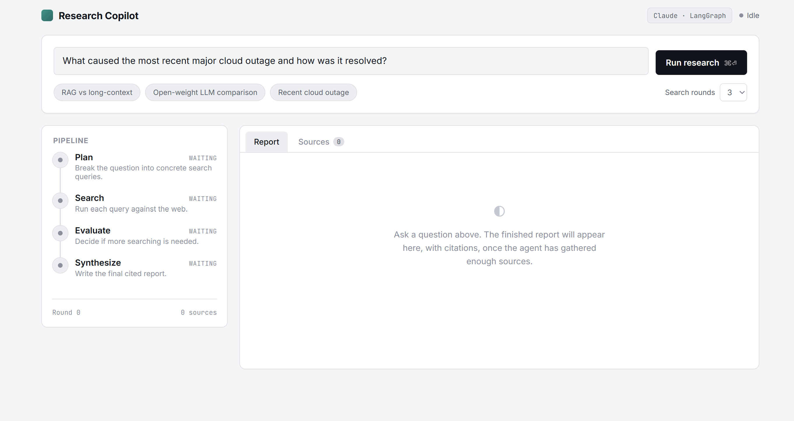

# AI Deep Research Agent

A portfolio project demonstrating an **agent**: given a question,
it plans several search queries, runs them against the web *and* any documents
you've uploaded (PDF/TXT/MD), decides for itself whether it has enough
information (looping back to search again if not), and then writes a
structured, cited report — streamed live to a browser as it works.

**Stack:** FastAPI · LangGraph · LangChain (Anthropic) · Tavily search ·
TF-IDF local document retrieval (scikit-learn, fully offline) · vanilla
HTML/CSS/JS frontend (SSE streaming, no framework/build step) · Docker.



## Why AI Deep Research Agent

Most AI “research assistants” are single-shot RAG systems that retrieve context once and generate an answer. While useful, they are essentially one-pass pipelines already commoditized by LLM APIs.

This project instead implements an explicit agentic state machine (`plan → search → evaluate → [loop | synthesize]`) using LangGraph, enabling real multi-step reasoning. The system dynamically decides what to search, when to continue searching, and when enough information has been gathered, before synthesizing a structured, source-backed report.

## Architecture

```
Browser (SSE client)
        │  POST /api/research  {query, max_iterations}
        ▼
FastAPI (backend/app/main.py)
        │  streams StreamingResponse (text/event-stream)
        ▼
LangGraph state machine (backend/app/agent.py)

   ┌────────┐     ┌────────┐     ┌──────────┐
   │  plan  │────▶│ search │────▶│ evaluate │──┐
   └────────┘     └────────┘     └──────────┘  │
                        ▲                       │
                        └── loop if more info needed
                                                 │
                                          ┌──────────────┐
                                          │  synthesize  │──▶ report (JSON)
                                          └──────────────┘
```

- **plan** — asks Claude to break the question into 2–4 concrete search queries
  (structured output via Pydantic, not free-text parsing).
- **search** — for the next queued query, searches the web (Tavily) *and* your
  uploaded documents (local TF-IDF index), tagging each hit `source: "web"` or
  `"local"` so the report can cite them correctly.
- **evaluate** — shows Claude what's been gathered so far (from both sources)
  and asks it to decide: enough info, or propose exactly one more query?
  Capped by `max_iterations` so the loop can't run forever.
- **synthesize** — writes the final report as structured JSON (title, summary,
  sections, each section's source URLs) so the frontend can render it without
  parsing markdown.

Every node's output streams to the frontend immediately as an SSE event, so
the UI shows the agent's reasoning trace live rather than a single spinner.

## Design decisions worth asking about in an interview

- **Structured output over prompt-and-parse.** Every LLM call in the graph
  uses `.with_structured_output(PydanticModel)` rather than asking for JSON
  in the prompt and regex-parsing it. Fewer silent failures, and the schema
  documents the contract.
- **LangGraph over a plain LangChain chain.** A chain can't express "loop
  while a condition holds" or "branch based on a decision the LLM just made."
  The conditional edge after `evaluate` is the actual agentic part of this
  project — a linear chain could not do it.
- **The search tool fails soft, not hard.** If Tavily errors on one query,
  that node logs it and returns an empty result list instead of crashing the
  whole run — one bad query shouldn't kill a multi-step process.
- **Iteration cap is enforced in code, not just prompted.** The LLM is asked
  to decide when to stop, but `iteration >= max_iterations` is also checked
  directly in `_evaluate_node`, so a model that never says "enough" can't
  loop forever and burn API budget.
- **TF-IDF instead of a downloaded embedding model for local documents.**
  `DocumentStore` (`backend/app/documents.py`) uses scikit-learn's
  `TfidfVectorizer` + cosine similarity, not a semantic embedding model.
  Embedding models (Chroma's bundled default, sentence-transformers, etc.)
  fetch a model file from the network on first use — one more thing that can
  fail behind a firewall or in a sandboxed CI environment, which is exactly
  what happened while building this. TF-IDF needs zero downloads, is
  deterministic, and is good enough for keyword-heavy queries against a
  handful of uploaded papers/reports. The `DocumentStore` interface (`add` /
  `delete` / `search`) doesn't change if you swap the internals for a real
  embedding model later — worth knowing as a documented tradeoff, not a gap.
- **SSE via raw `fetch` + `ReadableStream`, not `EventSource`.** `EventSource`
  only supports GET requests; this needed to POST a query body, so the
  frontend parses `text/event-stream` frames manually. Small, but a common
  gotcha worth knowing.
- **Frontend has zero build step.** No React/bundler — plain HTML/CSS/JS
  served directly by FastAPI's `StaticFiles`. Keeps the whole thing a single
  `docker build` away from running anywhere.

## Running it locally

```bash
cd backend
cp .env.example .env        # then fill in your keys
pip install -r requirements.txt
uvicorn app.main:app --reload
```

Open http://localhost:8000 — the backend also serves the frontend. Use the
"+ Add file" button to upload a PDF/TXT/MD; it's indexed immediately and the
"Documents" toggle controls whether the agent searches it alongside the web.

You'll need:
- An Anthropic API key (`ANTHROPIC_API_KEY`) — https://console.anthropic.com
- A free Tavily API key (`TAVILY_API_KEY`) — https://tavily.com

### With Docker

```bash
cp backend/.env.example backend/.env   # fill in your keys
docker compose up --build
```

## Running the tests

The graph logic is tested with a mocked LLM and mocked search tool, so it
runs without any API keys or network access — it verifies the plan → search →
evaluate → synthesize wiring, the loop/stop routing, state accumulation, and
that web + local document results are merged and tagged correctly.

```bash
cd backend
pip install -r requirements.txt pytest
pytest tests/ -q
```

## Project layout

```
ai-research-agent/
├── backend/
│   ├── app/
│   │   ├── main.py       # FastAPI routes, SSE streaming, document endpoints
│   │   ├── agent.py       # LangGraph state machine
│   │   ├── tools.py       # Tavily web search wrapper
│   │   ├── documents.py    # local document ingestion + TF-IDF retrieval
│   │   ├── schemas.py     # Pydantic models (API + structured LLM outputs)
│   │   └── config.py      # env-based settings
│   ├── data/               # uploaded-document index (created at runtime, gitignored)
│   ├── tests/
│   │   └── test_agent_flow.py
│   ├── requirements.txt
│   └── .env.example
├── frontend/
│   ├── index.html
│   ├── style.css
│   └── app.js
├── Dockerfile
├── docker-compose.yml
└── README.md
```

## Possible extensions

- Swap Tavily for a second tool (e.g. a calculator or code execution) and
  let `plan`/`evaluate` choose between tools, not just queries.
- Persist runs (SQLite) so past reports can be revisited.
- Add a `critique` node that scores the draft report and loops back to
  `search` if citations look thin — a second layer of self-evaluation.
